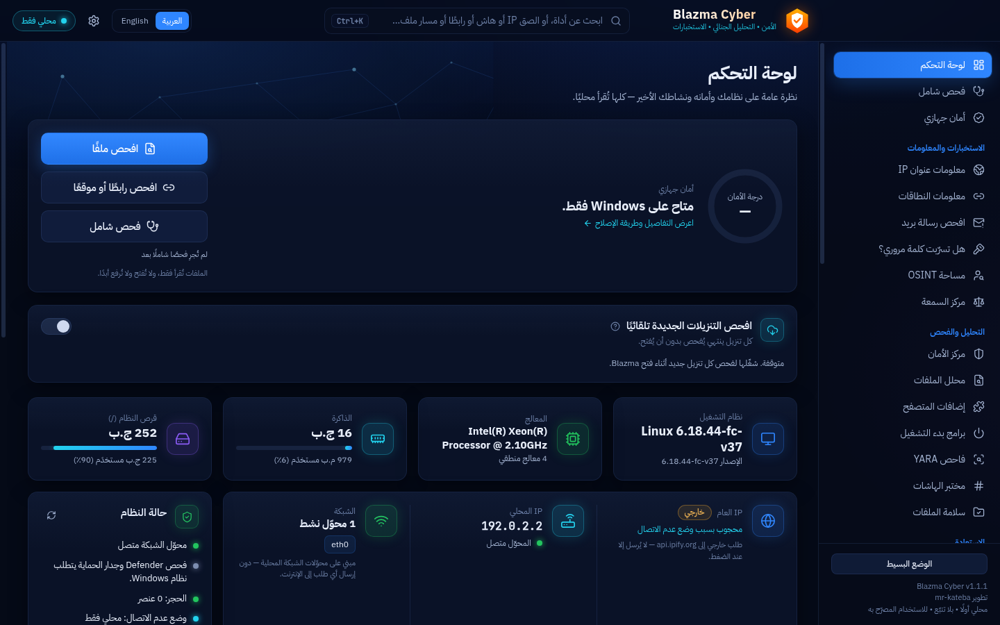

<div dir="rtl">

# Blazma Cyber — الشرح بالعربي

تطوير **[mr-kateba](https://github.com/mr-kateba)**

**الأمن • التحليل الجنائي • الاستخبارات**

برنامج سطح مكتب لـ Windows 10/11 للأمن السيبراني الدفاعي: تحليل الملفات، وفحص Defender وYARA،
والتحليل الجنائي، وأدوات الشبكة، ومعلومات IP والنطاقات، وOSINT، والقضايا والتقارير — بالعربي
والإنجليزي. يعمل محليًا على جهازك: بلا حساب، بلا تفعيل، بلا تتبّع، ووضع عدم الاتصال مفعّل افتراضيًا.

> [English README](README.md)



### الجديد في 1.1.0
- **الواي فاي**: أمان اتصالك الحالي بكلام بسيط، الشبكات القريبة مع كشف الشبكات المنتحِلة (Evil Twin)
  وازدحام القنوات، ومراجعة الشبكات المحفوظة — بدون قراءة كلمات المرور أبدًا.
- **حركة الشبكة**: حلّل ملفات Wireshark (pcap/pcapng) أو سجّل من 15 ثانية إلى 5 دقائق عبر pktmon المدمج
  في Windows: الأجهزة وشركاتها المصنّعة، المواقع، DNS، تسجيلات الدخول غير المشفّرة، وأنماط مثل فحص
  المنافذ وانتحال ARP وخادم DHCP دخيل.
- **فحص الخدمات (Nmap)**: إذا ثبّتّ Nmap: من المتصل بشبكتك وما الخدمات المفتوحة على كل جهاز، مع شرح
  الخطورة — لشبكاتك أنت فقط وبعد تأكيد التصريح.
- **المنافذ المفتوحة على جهازك**: أي البرامج تنتظر اتصالات، وهل يصل إليها جهازك فقط أم الشبكة، وما وظيفة كل منفذ معروف.
- **مراقبة سلامة الملفات**: خذ بصمة لمجلد ثم اعرف بدقة ما أُضيف أو حُذف أو تغيّر، حتى لو زُوّر التاريخ.
- **فحص شامل بضغطة واحدة**: أمان الجهاز، علامات العبث، إضافات المتصفح، الواي فاي والمجلدات المراقَبة — بنتيجة واحدة واضحة.
- **البحث الذكي (Ctrl+K)**: الصق IP أو هاش أو رابطًا أو بريدًا أو مسار ملف وانتقل مباشرة للأداة المناسبة.
- **سمة فاتحة** وخيار «مثل إعداد Windows».

---

## الطريقة 1: تنزيل المثبّت الجاهز (الأسهل)

### 1) التنزيل
- افتح صفحة **[الإصدارات (Releases)](https://github.com/mr-kateba/Blazma-Cyber/releases)** — تظهر أيضًا في
  يمين صفحة المستودع الرئيسية تحت **Releases**.
- نزّل `Blazma-Cyber-1.0.1-x64-setup.exe` من قسم **Assets**. لا يحتاج تسجيل دخول.
- رابط مباشر لآخر إصدار (v1.0.1):
  https://github.com/mr-kateba/Blazma-Cyber/releases/download/v1.0.1/Blazma-Cyber-1.0.1-x64-setup.exe

#### (اختياري) تحقّق أن الملف سليم وأصلي
- **البصمة:** في PowerShell: `Get-FileHash .\Blazma-Cyber-1.0.1-x64-setup.exe -Algorithm SHA256`
  ويجب أن تطابق القيمة في ملف `SHA256SUMS.txt` وفي صفحة الإصدار.
- **شهادة مصدر البناء (من GitHub):** `gh attestation verify .\Blazma-Cyber-1.0.1-x64-setup.exe -R mr-kateba/Blazma-Cyber`
  تثبت أن الملف بُني من هذا المستودع عبر GitHub Actions ولم يُعدَّل بعدها (تحتاج أداة [GitHub CLI](https://cli.github.com)).

> نسخ أحدث للمطوّرين تُبنى تلقائيًا بعد كل تعديل في **Actions → CI → Artifacts →
> installer-windows-unsigned** (تحتاج تسجيل دخول، وتبقى 14 يومًا).

### 2) التثبيت
> **بدون تثبيت؟** نزّل `Blazma-Cyber-*-x64-portable.zip` بدلًا من المثبّت، فكّ الضغط في أي مجلد أو ذاكرة USB، وشغّل `Blazma Cyber.exe`. كل البيانات تبقى في مجلد `Blazma-data` بجانبه.

1. شغّل `Blazma-Cyber-1.0.1-x64-setup.exe`.
2. ستظهر رسالة **"Windows protected your PC"** (حماية Windows). هذا متوقع لأن المثبّت
   **غير موقّع رقميًا بعد** (التوقيع يحتاج شهادة مدفوعة). اضغط **More info** ثم **Run anyway**.
3. اختر لغة المثبّت (العربية أو English).
4. اختر مجلد التثبيت أو اترك الافتراضي، ثم **Install**.
   - التثبيت للمستخدم الحالي فقط، **ولا يطلب صلاحيات المسؤول**.
   - يُنشئ اختصارًا على سطح المكتب وفي قائمة ابدأ.

### 3) التشغيل
- افتح **Blazma Cyber** من سطح المكتب أو قائمة ابدأ.
- أول مرة: اختر اللغة (العربية / English)، ويمكن تغييرها لاحقًا من الإعدادات.
- **وضع عدم الاتصال مفعّل** افتراضيًا: كل الوحدات المحلية تعمل، وأي استعلام خارجي (مثل معلومات IP
  أو VirusTotal) محجوب حتى تسمح به بنفسك من **مركز الخصوصية**.

### 4) الإزالة
- **الإعدادات ← التطبيقات ← Blazma Cyber ← إزالة التثبيت**.
- بياناتك (الإعدادات، القضايا، التقارير، الحجر) **تبقى** في `%APPDATA%\Blazma Cyber` حتى لا تضيع
  بالخطأ. لحذفها: من **مركز الخصوصية ← مسح البيانات المحلية** قبل الإزالة، أو احذف المجلد يدويًا.

---

## الطريقة 2: التشغيل من الكود المصدري (للمطوّرين)

**المتطلبات:** Windows 10/11 64-bit، و[Node.js 20 أو أحدث](https://nodejs.org) (يُفضّل 22 LTS)، وGit.

```powershell
git clone https://github.com/mr-kateba/Blazma-Cyber.git Blazma-Cyber
cd Blazma-Cyber
.\Start-Blazma.ps1 -Install     # أول مرة: يثبّت الاعتماديات، يبني البرنامج، ويشغّله
.\Start-Blazma.ps1              # المرات التالية
```

خيارات المشغّل:

| الخيار | الوظيفة |
|---|---|
| `-Install` | تثبيت الاعتماديات (لا يثبّت شيئًا بدون هذا الخيار) |
| `-Dev` | وضع التطوير مع إعادة التحميل التلقائي |
| `-SkipBuild` | التشغيل بدون إعادة البناء |

لبناء المثبّت بنفسك على Windows:

```powershell
npm ci
npm run dist:win     # الناتج: release\Blazma-Cyber-<الإصدار>-x64-setup.exe
```

---

## المحركات المضمّنة

مثبّت Windows يأتي ومعه، بدون أي تثبيت إضافي:
- **YARA-X** مع **1,240 قاعدة من ReversingLabs** لكشف عائلات البرامج الضارة.
- **capa** (من Mandiant): يشرح «ماذا يستطيع هذا البرنامج أن يفعل؟» مع رموز MITRE ATT&CK.
- **Detect It Easy**: يعرف بماذا بُني الملف وهل هو مضغوط أو محمي.
- **Hayabusa** مع أكثر من 4000 قاعدة Sigma: يبحث في سجلات أحداث Windows عن آثار الهجمات.

نُزّلت من إصداراتها الرسمية وقت بناء البرنامج، وتم التحقق منها ببصمات SHA-256 مثبّتة. البرنامج نفسه لا ينزّل أي شيء.

## محركات اختيارية

تُثبَّت منفصلة إذا احتجتها، و**البرنامج لا ينزّل أو يشغّل أي ملف تنفيذي تلقائيًا**:

| المحرك | الفائدة | الإعداد |
|---|---|---|
| Microsoft Defender | فحص الملفات والمجلدات | موجود مع Windows — لا يحتاج إعدادًا |
| YARA-X بإصدار مختلف | مضمَّن أصلًا — فقط إذا أردت استخدام نسختك الخاصة | **الإعدادات ← المحركات ← إعداد** ثم اختر مسار `yr.exe` |
| Nmap (من nmap.org) | فحص الخدمات في شبكتك (صفحة «فحص الخدمات») | ثبّته ثم افتح الصفحة — يُكتشف تلقائيًا |
| Wireshark + Npcap | تسجيل حركة الشبكة بدون صلاحيات المسؤول وفتح التسجيلات في Wireshark | ثبّته — بدونه يُستخدم pktmon المدمج في Windows |
| John the Ripper / hashcat | استعادة كلمات المرور لملفاتك المصرّح لك بها فقط | **الإعدادات ← المحركات ← إعداد** (يفتح استعادة كلمات المرور) ثم اختر الملف التنفيذي |
| مفاتيح VirusTotal / AbuseIPDB / Shodan / abuse.ch | فحص السمعة (مفتاح abuse.ch مجاني من auth.abuse.ch ويشغّل MalwareBazaar وURLhaus وThreatFox) | **الإعدادات ← مفاتيح API** (تُحفظ مشفّرة بـ DPAPI) |

---

## حلّ المشاكل

| المشكلة | الحل |
|---|---|
| "Windows protected your PC" | المثبّت غير موقّع: **More info ← Run anyway** |
| المتصفح يحذّر من الملف | نفس السبب (غير موقّع) — اختر الاحتفاظ بالملف |
| "Node.js was not found" | ثبّت Node.js 20+ وأعد فتح PowerShell (الطريقة 2 فقط) |
| تشغيل السكربتات معطّل | `powershell -ExecutionPolicy RemoteSigned -File .\Start-Blazma.ps1` أو `Unblock-File .\Start-Blazma.ps1` |
| "Blocked by Offline Mode" / "محجوب: وضع عدم الاتصال" | طبيعي — أوقف وضع عدم الاتصال من **مركز الخصوصية** إذا أردت الاستعلامات الخارجية |
| حالة Defender "غير متاحة" | قد يكون برنامج حماية آخر مثبّتًا، أو Defender معطّل بسياسة |

---

## حالة المشروع

- كل الوحدات تعمل. زر **الطرفية** يفتح طرفية Windows العادية (Windows Terminal أو PowerShell) في نافذة منفصلة.
- **مُتحقَّق منه على Windows حقيقي** (Windows Server 2025، نفس أساس Windows 11) عبر الفحص التلقائي:
  استعلامات PowerShell، حالة Defender وفحص ملف، التوقيع الرقمي، التحليل الجنائي، أدوات الشبكة،
  الواجهة كاملة، وبناء المثبّت.
- **لم يُختبر بعد على جهاز Windows 10/11 عادي:** التثبيت والإزالة، شكل شريط العنوان، المشغّل
  `Start-Blazma.ps1`، فحص Defender السريع والكامل، ومحركات John وhashcat الحقيقية.
- التفاصيل: [docs/ROADMAP.md](docs/ROADMAP.md) · تقرير الفحص الكامل بالعربي:
  [docs/AUDIT-REPORT.md](docs/AUDIT-REPORT.md)

## الخصوصية والأمان
- لا تتبّع، لا حساب، لا رفع ملفات تلقائي. كل طلب خارجي يظهر في **مركز الخصوصية ← نشاط الشبكة**.
- البرنامج **لا ينفّذ الملفات التي يحللها**، ولا يعطّل Defender، ولا يغيّر الجدار الناري.
- التفاصيل: [PRIVACY.md](PRIVACY.md) · [SECURITY.md](SECURITY.md)

## الاستخدام المصرّح به
مخصّص للاستخدام الدفاعي على الأجهزة والشبكات والملفات التي تملكها أو المصرّح لك بفحصها.

## الترخيص
حقوق النشر © 2026 [mr-kateba](https://github.com/mr-kateba).

البرنامج مفتوح المصدر بترخيص **GNU GPL الإصدار 3 أو أحدث** ([LICENSE](LICENSE)):
- تقدر تستخدمه وتنسخه وتعدّله وتوزّعه بحرية.
- أي شخص يوزّع نسخة معدّلة **لازم ينشر كودها بنفس الترخيص** ويذكر المصدر، فلا أحد يقدر يأخذه ويغلقه أو يبيعه كبرنامج مغلق.
- البرنامج يُقدَّم **بدون أي ضمان**.

الأدوات والمكتبات الخارجية لها تراخيصها الخاصة: [THIRD-PARTY-NOTICES.md](THIRD-PARTY-NOTICES.md).

</div>
