<div align="center">

# Blazma Cyber
### Security • Forensics • Intelligence
**الأمن • التحليل الجنائي • الاستخبارات**

A privacy-first, local-first, bilingual (العربية / English) Windows cybersecurity workbench.

By **[mr-kateba](https://github.com/mr-kateba)**

**[الشرح بالعربي — التنزيل والتثبيت والتشغيل](README.ar.md)**

</div>


## Overview
Blazma Cyber brings defensive security, static file analysis, YARA, hashing, intelligence, OSINT,
Windows forensics, network diagnostics, authorized password recovery, cases, reports and threat
hunting into one modern desktop application — without accounts, activation or telemetry. It
integrates mature engines (Microsoft Defender, YARA-X, John the Ripper / hashcat) through clean
adapters rather than re-implementing them.

> **Status: v1.1.0 (stable).** "Terminal" opens the regular Windows terminal
> (Windows Terminal, else PowerShell) in its own window. Verified end-to-end on Linux and, through CI,
> on real Windows (Server 2025, build 26100 — the Windows 11 24H2 code base): PowerShell queries,
> Defender status and file scan, Authenticode, forensics, network tools, the full UI and the NSIS
> installer build. **Not yet verified on a Windows 10/11 desktop:** installing/uninstalling, the
> title bar, the launcher, Defender quick/full scans. See [docs/ROADMAP.md](docs/ROADMAP.md).

## Features
**Security & analysis**
- **Dashboard** — real OS, CPU, memory, disk, network adapters, live gauges, Defender and firewall
  status (Windows), recent activity. Public IP only on explicit request.
- **File Analyzer** — streaming MD5/SHA-1/SHA-256/SHA-512, file type by magic bytes, entropy, PE
  headers/sections/imports/exports, embedded IOCs, notable strings, Authenticode (Windows),
  encrypted-file detection, optional Defender + YARA-X, hash-only reputation (VirusTotal,
  MalwareBazaar, URLhaus, ThreatFox), and a
  combined assessment that never claims "clean" when engines are missing. Files are never executed.
- **Security Center** — Microsoft Defender quick/full/file/folder scans (file/folder scans are
  report-only), threat history, quarantine.
- **Quarantine** — neutralized storage, SHA-256-verified restore; nothing is deleted automatically.
- **YARA scanner** — adapter to the user-installed YARA-X `yr` CLI, rule manager with validation.
- **Hash Lab** — hash text/files, verify, identify formats (ranked possibilities), compare.
- **File integrity monitor** — fingerprint a folder (SHA-256 of every file), then see exactly what
  was added, removed or changed; flags content edits that kept the old timestamp and changed files
  that can run code. Suggested places: Startup folders, the hosts folder, PowerShell profiles.

**Intelligence**
- **IP / Domain Intelligence** — reverse DNS, RDAP, Team Cymru ASN, approximate location (ipinfo),
  Tor exit check, DNS records, SPF/DMARC, TLS certificate, hosting infrastructure.
- **Reputation Center** — VirusTotal, AbuseIPDB, Shodan and abuse.ch (MalwareBazaar, URLhaus,
  ThreatFox — one free key) with your own keys (hashes, never uploads).
- **Check an email** — local phishing analysis of a saved .eml or pasted source: sender spoofing,
  SPF/DKIM/DMARC, deceptive links, dangerous attachments (handed to File Analyzer, never opened).
- **Event log hunting** — bundled Hayabusa with 4,000+ Sigma/Hayabusa rules over .evtx files or this
  computer's logs (administrator rights requested only for that scan, with an explanation).
- **Browser extensions & signs of tampering** — what add-ons may do and how they were installed;
  hosts file, proxy, DNS and added root certificates. Opt-in **Downloads watcher**.
- **Was my password leaked?** — Have I Been Pwned via k-anonymity: only 5 characters of the
  password's SHA-1 hash leave the computer.
- **OSINT Workspace** — domain, email, username or URL: Certificate Transparency (crt.sh), Wayback
  Machine snapshots, GitHub public profile, mail-domain DNS; **accounts with a username** on 301
  social networks (+338 other sites, optional) using the WhatsMyName rules — found / not found /
  couldn't check, never guessed; provenance (endpoint + time) on every source; pivot links open in
  your browser only after confirmation.

**Network**
- **Wi-Fi** — current connection (security in plain words, signal, band/channel, link speed), nearby
  networks with an evil-twin check and a channel chart, and an audit of saved networks (open networks
  that join automatically, weak or hidden ones) — read-only, passwords are never read.
- **Network traffic** — analyse .pcap/.pcapng files or record 15 s – 5 min with Windows pktmon (one
  UAC prompt) or Wireshark's dumpcap: devices with their manufacturer, conversations, DNS, HTTPS
  sites, unencrypted logins, and measured patterns (port scan, ARP conflict, rogue DHCP, outdated
  TLS…). Cookies, passwords and page contents never enter the report.
- **Service scan (Nmap)** — with your own Nmap install: who is online, and which services each
  device exposes (100 / 1,000 ports), with plain-language risks (telnet, open databases, VNC, RDP…).
  Only your own networks, after an authorization confirmation.

**Forensics & network tools**
- **Windows Forensics** — read-only collectors: processes, connections, services, drivers,
  startup, scheduled tasks, users, software, USB history, events (Linux `/proc` fallbacks).
- **Network Toolkit** — ping, traceroute, DNS, reverse DNS, routes, ARP, adapters; port check and
  local /24 discovery require an explicit authorization confirmation.
- **Threat Hunting** — correlate an IP/domain/hash/text across cases, quarantine, activity, the
  network log, live processes/connections/services/startup and YARA rules; persistence review.

**Recovery & investigations**
- **Password Recovery** — for files you own or are authorized to recover: encrypted-file detection
  (ZIP/7z/RAR/PDF/Office) + your own John the Ripper / hashcat. Results are shown once, never logged.
- **Cases** — `CASE-YYYY-NNN`, evidence vs. notes, automatic timeline, "Add to case" from modules.
- **Reports** — HTML (escaped, script-free, strict CSP), JSON and PDF, in Arabic (RTL) or English.

**For everyday users**
- **Device Security** — a score out of 100 from 16 read-only Windows checks, each explained in plain
  Arabic/English with how to fix it (Blazma never changes settings).
- **Simple mode** — only the essentials (device security, scan a file, check a link), plain-language
  verdicts ("What should I do?"), a "What does this mean?" button on technical terms, and drop a
  file anywhere to scan it.

**Everywhere**
- **Smart search (Ctrl+K)** — paste an IP, hash, domain, link, e-mail, @username or file path
  (defanged `hxxp`/`[.]` too) and jump straight to the tool that examines it, pre-filled.
- **Themes** — deep navy, midnight black, light, or match Windows.

**Privacy & language**
- **Privacy Center** — Offline Mode (on by default), log of every external request, clear local data.
- **Arabic & English** — full translation, RTL/LTR switching, technical values kept LTR.

| | |
|---|---|
| 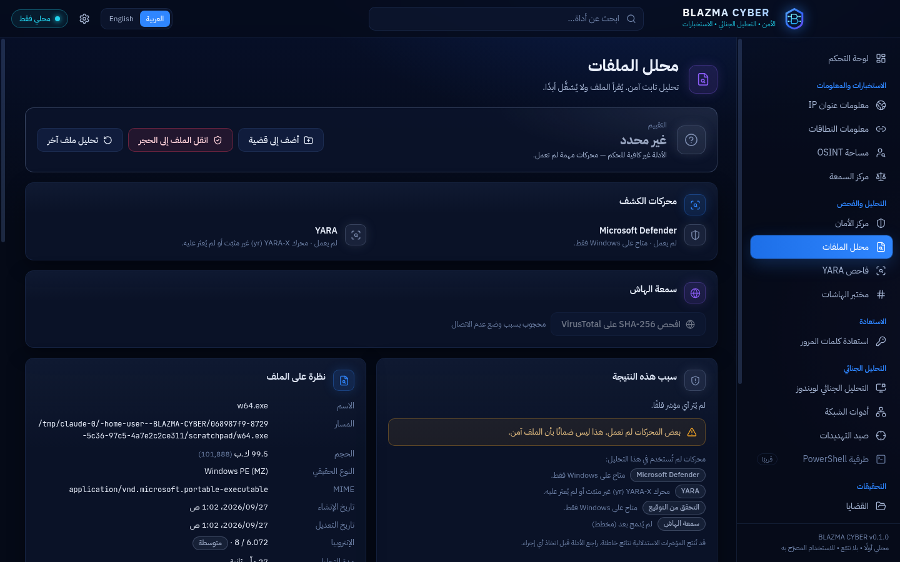 | 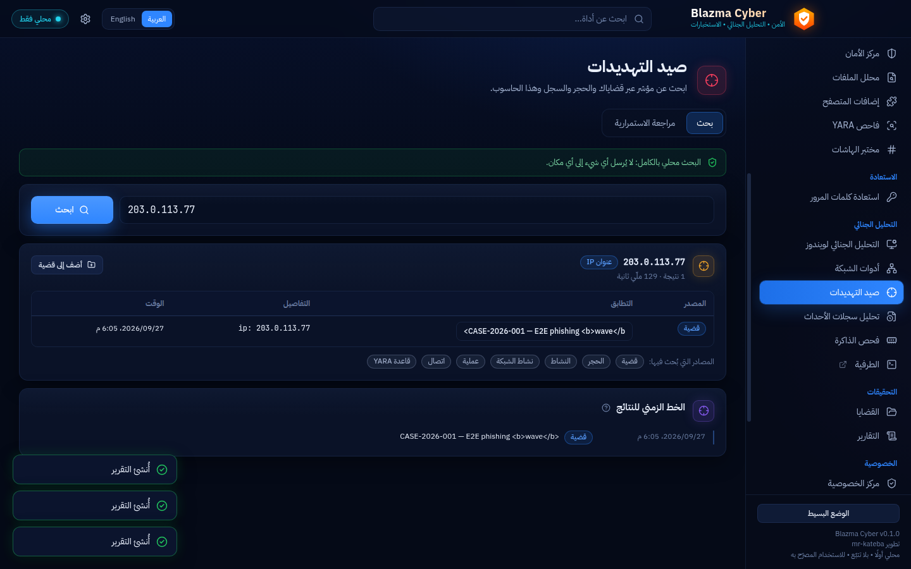 |
| 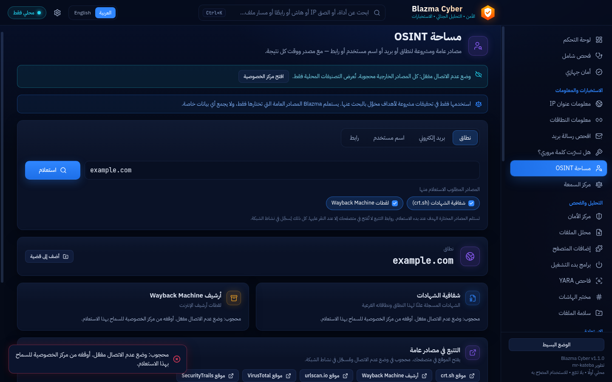 | 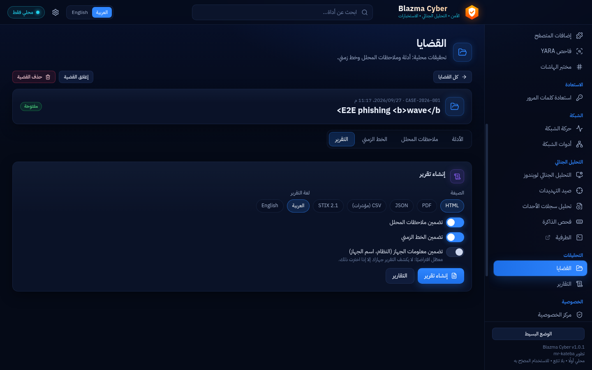 |
| 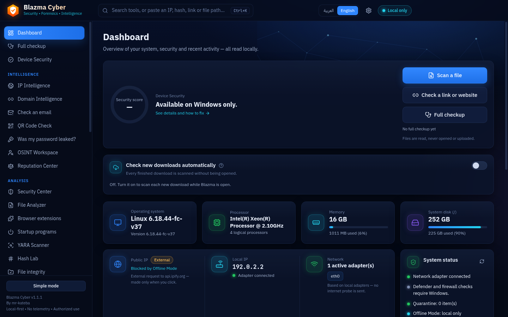 | 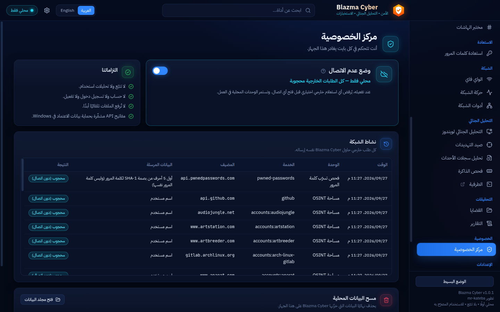 |
| 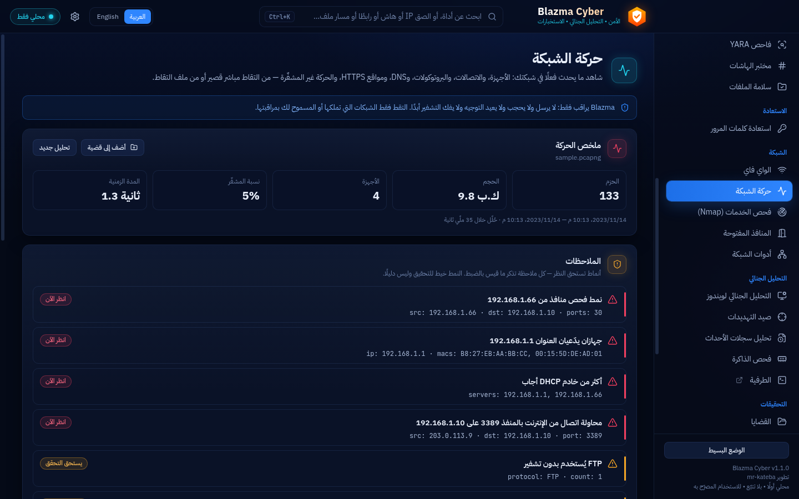 | 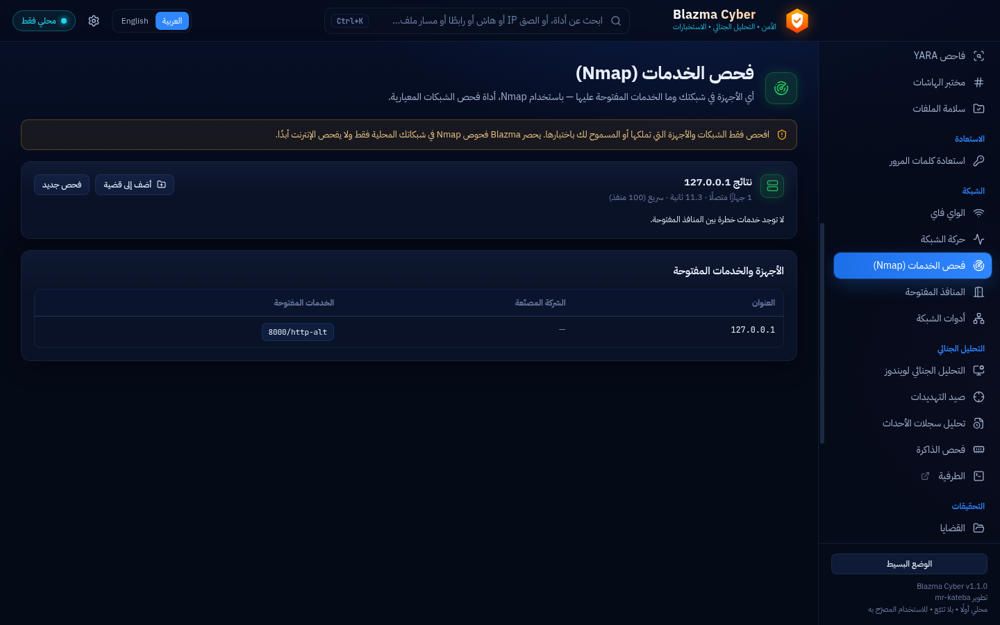 |
| 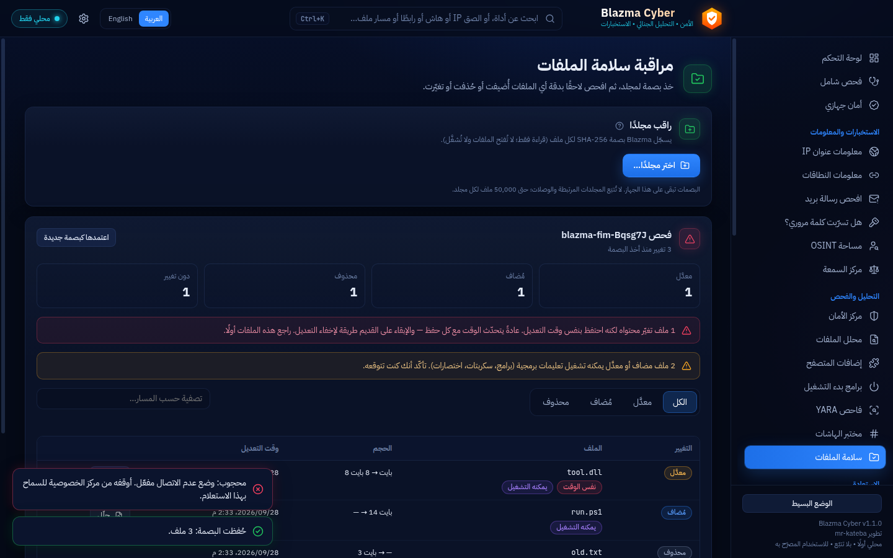 | 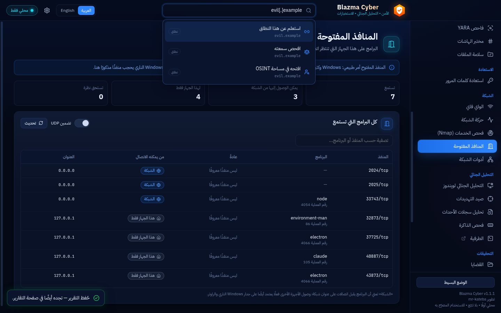 |
| 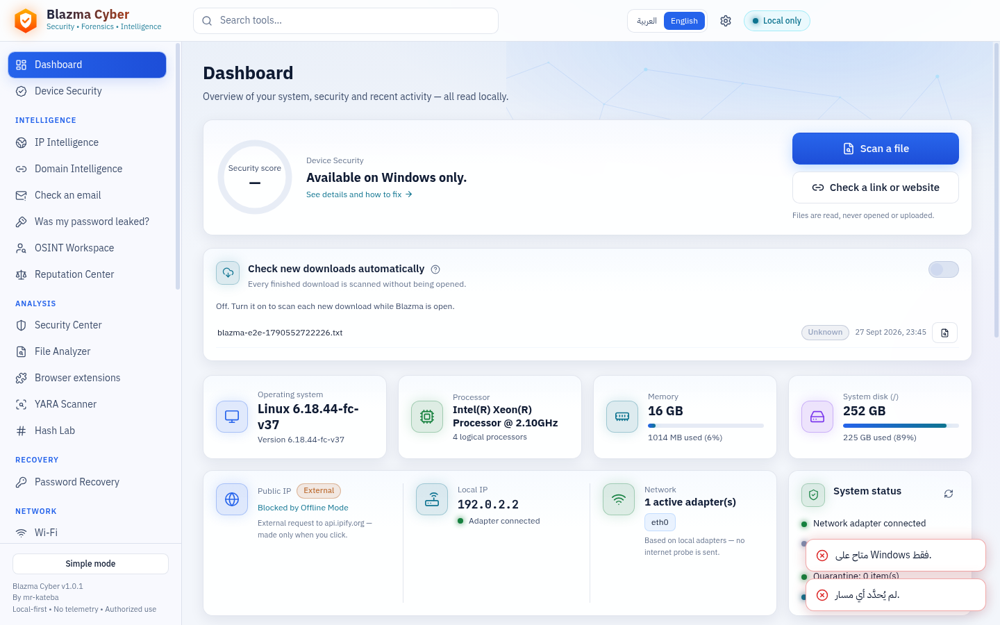 | |

## Installation (development build)
Requirements: Windows 10/11 x64, [Node.js 20+](https://nodejs.org).

```powershell
git clone <repo-url> Blazma-Cyber
cd Blazma-Cyber
.\Start-Blazma.ps1 -Install     # first time: installs locked dependencies, builds, launches
.\Start-Blazma.ps1              # afterwards
```
The launcher checks prerequisites and prints clear errors (English + Arabic). It never installs
anything unless you pass `-Install`.

## Download the installer
Get it from **[Releases](https://github.com/mr-kateba/Blazma-Cyber/releases)** (latest release:
[`Blazma-Cyber-1.0.1-x64-setup.exe`](https://github.com/mr-kateba/Blazma-Cyber/releases/download/v1.0.1/Blazma-Cyber-1.0.1-x64-setup.exe)).
It is unsigned, so SmartScreen shows "Windows protected your PC" → **More info → Run anyway**.
Verify it with `SHA256SUMS.txt` or `gh attestation verify <file> -R mr-kateba/Blazma-Cyber`
(GitHub build provenance). Development builds: **Actions → CI → Artifacts** (sign-in, 14 days).
Step-by-step in Arabic: [README.ar.md](README.ar.md).

## Building the installer
```powershell
npm ci
npm run dist:win   # → release\Blazma-Cyber-<version>-x64-setup.exe
```
Per-user NSIS installer (no administrator rights, Arabic + English), hardened Electron fuses, no
auto-update. Run it **on Windows** (on Linux the NSIS uninstaller step needs Wine). CI builds it on
Windows and uploads it as an artifact; installing/uninstalling hasn't been tested yet, and builds are unsigned unless you provide a
certificate through `CSC_LINK` / `CSC_KEY_PASSWORD`. Details: [docs/DEVELOPMENT.md](docs/DEVELOPMENT.md).

## Development
```bash
npm ci
npm run dev      # hot-reload development
npm run check    # typecheck + unit tests + locale parity
```
See [docs/DEVELOPMENT.md](docs/DEVELOPMENT.md) and [CLAUDE.md](CLAUDE.md).

## Privacy model
No telemetry, no account, no automatic uploads. Offline Mode blocks all external requests before a
connection is opened; every attempted request is visible in Network Activity. Details:
[PRIVACY.md](PRIVACY.md).

## Security
Sandboxed renderer, strict CSP, validated IPC, no shell execution, PowerShell with fixed scripts,
DPAPI-encrypted API keys, redacted logs, gated and allowlisted external links, hardened packaged
build (Electron fuses, asar integrity). Details: [SECURITY.md](SECURITY.md) ·
Architecture: [docs/ARCHITECTURE.md](docs/ARCHITECTURE.md).

## Supported engines
| Engine | Status |
|---|---|
| Built-in static analyzer (hashes, PE, entropy, IOCs, encrypted files) | Available |
| Windows Authenticode verification | Available — verified on Windows in CI |
| Microsoft Defender status & scanning | Available — status, file scan (EICAR) and history verified on Windows in CI; quick/full scans not run in CI |
| YARA-X (`yr` CLI, user-installed) | Available — tested with yr 1.20.0 |
| John the Ripper / hashcat (user-installed, authorized recovery) | Available — tested with a stand-in engine; real engines need verification |
| Nmap (user-installed, local networks only) | Available — tested with Nmap 7.94 (Linux); Windows install not verified in CI |
| Windows pktmon / Wireshark dumpcap (capture) | pktmon verified on Windows in CI; dumpcap used when Wireshark + Npcap are installed |

## Troubleshooting
| Problem | Solution |
|---|---|
| “Node.js was not found” | Install Node.js 20+ LTS and reopen PowerShell |
| “Dependencies are not installed” | Run `.\Start-Blazma.ps1 -Install` |
| Script execution is disabled | Run `powershell -ExecutionPolicy RemoteSigned -File .\Start-Blazma.ps1` for this session, or `Unblock-File .\Start-Blazma.ps1` |
| Defender shows “status unavailable” | Another antivirus may manage protection, or Defender is disabled by policy |
| “Access denied” when analyzing a file | The file is locked or protected; copy it elsewhere or run the specific operation with appropriate rights |
| Public IP says “Blocked by Offline Mode” | Expected — turn Offline Mode off in the Privacy Center if you want online lookups |

## Authorized use
Intended for defensive use on systems, networks and files you own or are authorized to assess.

## License
Copyright © 2026 [mr-kateba](https://github.com/mr-kateba).

Blazma Cyber is free software: you can redistribute it and/or modify it under the terms of the
**GNU General Public License v3.0 or later** ([LICENSE](LICENSE)). It is distributed WITHOUT ANY
WARRANTY. Anyone who distributes a modified version must publish its source under the same license.
Third-party components keep their own licenses: [THIRD-PARTY-NOTICES.md](THIRD-PARTY-NOTICES.md).
