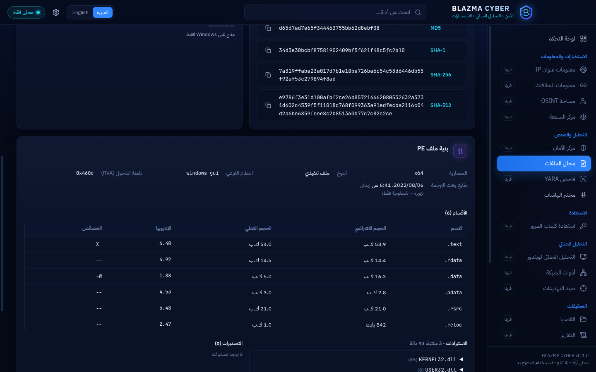

<div align="center">

# BLAZMA CYBER
### Security • Forensics • Intelligence
**الأمن • التحليل الجنائي • الاستخبارات**

A privacy-first, local-first, bilingual (العربية / English) Windows cybersecurity workbench.

</div>


## Overview
BLAZMA CYBER brings defensive security, static file analysis, hashing, and (on the roadmap)
intelligence, forensics, network diagnostics and authorized password recovery into one modern
desktop application — without accounts, activation or telemetry. It integrates mature engines
(Microsoft Defender, YARA-X, …) through clean adapters rather than re-implementing them.

> **Status: early development (v0.1).** Foundation, File Analyzer and Hash Lab work today.
> Other modules are shown in the app as *planned* and do nothing until implemented.
> See [docs/ROADMAP.md](docs/ROADMAP.md).

## Features available now
- **Dashboard** — real OS, CPU, memory, disk, network adapters, live CPU/RAM/disk gauges,
  Defender and firewall status (Windows), recent activity. Public IP only on explicit request.
- **File Analyzer** — drag & drop; streaming MD5/SHA-1/SHA-256/SHA-512; real file type by magic
  bytes; entropy; PE headers, sections, imports, exports and packer hints; embedded URLs, domains,
  IPs, emails; notable strings; Authenticode signature (Windows); a combined assessment that
  explains *why* and never claims “clean” when engines are missing. Files are never executed.
- **Hash Lab** — hash text or files, verify integrity against a published hash, identify hash
  formats (ranked possibilities, not false certainty), compare hashes.
- **Privacy Center** — Offline Mode (on by default), log of every external request, clear local data.
- **Settings** — language, theme, start page, notifications, history, log level, encrypted API keys.
- **Arabic & English** — full translation, RTL/LTR layout switching, technical values kept LTR.

| | |
|---|---|
|  |  |
|  |  |

## Installation (development build)
Requirements: Windows 10/11 x64, [Node.js 20+](https://nodejs.org).

```powershell
git clone <repo-url> BLAZMA-CYBER
cd BLAZMA-CYBER
.\Start-Blazma.ps1 -Install     # first time: installs locked dependencies, builds, launches
.\Start-Blazma.ps1              # afterwards
```
The launcher checks prerequisites and prints clear errors (English + Arabic). It never installs
anything unless you pass `-Install`. Installer packages are planned (Phase 7).

## Development
```bash
npm ci
npm run dev      # hot-reload development
npm run check    # typecheck + unit tests + locale parity
```
See [docs/DEVELOPMENT.md](docs/DEVELOPMENT.md) and [CLAUDE.md](CLAUDE.md).

## Privacy model
No telemetry, no account, no automatic uploads. Offline Mode blocks all external requests before a
connection is opened; every attempted request is visible in Network Activity. Details:
[PRIVACY.md](PRIVACY.md).

## Security
Sandboxed renderer, strict CSP, validated IPC, no shell execution, PowerShell with fixed scripts,
DPAPI-encrypted API keys, redacted logs. Details: [SECURITY.md](SECURITY.md) ·
Architecture: [docs/ARCHITECTURE.md](docs/ARCHITECTURE.md).

## Supported engines
| Engine | Status |
|---|---|
| Built-in static analyzer (hashes, PE, entropy, IOCs) | Available |
| Windows Authenticode verification | Available on Windows |
| Microsoft Defender status | Available on Windows |
| Microsoft Defender scanning | Planned (Phase 2) |
| YARA-X | Planned (Phase 2) |
| hashcat / John the Ripper (authorized recovery) | Planned (Phase 5) |

## Troubleshooting
| Problem | Solution |
|---|---|
| “Node.js was not found” | Install Node.js 20+ LTS and reopen PowerShell |
| “Dependencies are not installed” | Run `.\Start-Blazma.ps1 -Install` |
| Script execution is disabled | Run `powershell -ExecutionPolicy RemoteSigned -File .\Start-Blazma.ps1` for this session, or `Unblock-File .\Start-Blazma.ps1` |
| Defender shows “status unavailable” | Another antivirus may manage protection, or Defender is disabled by policy |
| “Access denied” when analyzing a file | The file is locked or protected; copy it elsewhere or run the specific operation with appropriate rights |
| Public IP says “Blocked by Offline Mode” | Expected — turn Offline Mode off in the Privacy Center if you want online lookups |

## Authorized use
Intended for defensive use on systems, networks and files you own or are authorized to assess.

## License
Project license to be decided by the owner. Third-party components: [THIRD-PARTY-NOTICES.md](THIRD-PARTY-NOTICES.md).
